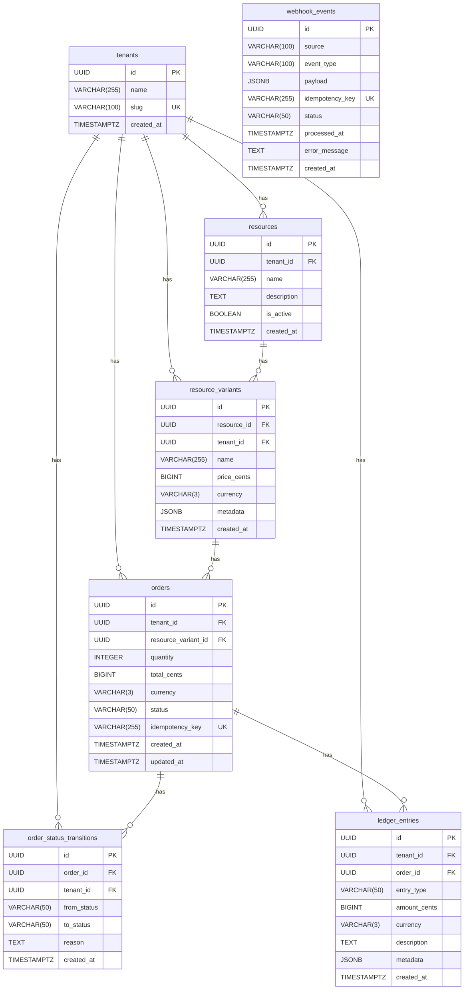

# Entity Relationship Diagram

## Tables



## Row-Level Security

All tables have Row-Level Security enabled. Tenant isolation is enforced via PostgreSQL policies:

```sql
CREATE POLICY tenant_isolation_resources ON resources
  USING (tenant_id::text = current_setting('app.current_tenant_id'));
```

Each backend request sets `app.current_tenant_id` within a transaction using `SET LOCAL`. Queries automatically return only rows belonging to the active tenant — no application-level `WHERE` clause required.

The `webhook_events` table uses `USING (true)` — it is not tenant-isolated because webhook deduplication must work across tenants.

## Indexes

| Table | Index | Column(s) | Purpose |
|-------|-------|-----------|---------|
| resources | `idx_resources_tenant_id` | `tenant_id` | Tenant filtering |
| resource_variants | `idx_resource_variants_resource_id` | `resource_id` | Parent resource lookup |
| resource_variants | `idx_resource_variants_tenant_id` | `tenant_id` | Tenant filtering |
| orders | `idx_orders_tenant_id` | `tenant_id` | Tenant filtering |
| orders | `idx_orders_status` | `status` | Status filtering |
| orders | `idx_orders_idempotency_key` | `idempotency_key` | Idempotent order creation |
| order_status_transitions | `idx_order_status_transitions_order_id` | `order_id` | Order audit trail |
| order_status_transitions | `idx_order_status_transitions_tenant_id` | `tenant_id` | Tenant filtering |
| ledger_entries | `idx_ledger_entries_tenant_id` | `tenant_id` | Tenant filtering |
| ledger_entries | `idx_ledger_entries_order_id` | `order_id` | Order ledger lookup |
| ledger_entries | `idx_ledger_entries_created_at` | `created_at` | Time-range queries |
| webhook_events | `idx_webhook_events_idempotency_key` | `idempotency_key` | Deduplication (UNIQUE) |
| webhook_events | `idx_webhook_events_status` | `status` | Status filtering |

## Migration Order

Migrations run sequentially from `001` to `008`:

1. `001_create_tenants.sql`
2. `002_create_resources.sql`
3. `003_create_resource_variants.sql`
4. `004_create_orders.sql`
5. `005_create_order_status_transitions.sql`
6. `006_create_ledger_entries.sql`
7. `007_create_webhook_events.sql`
8. `008_enable_rls.sql` — enables RLS and creates policies on all tables
